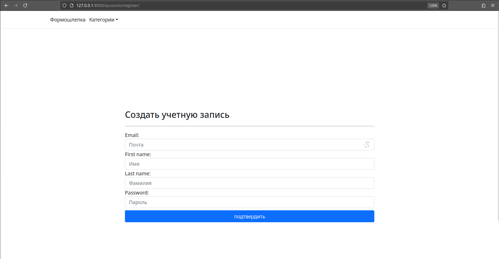
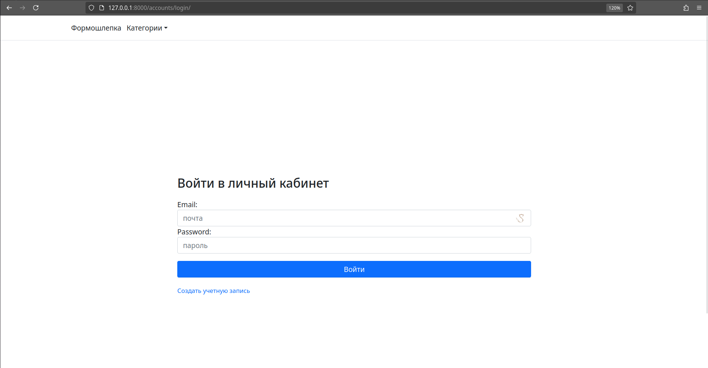
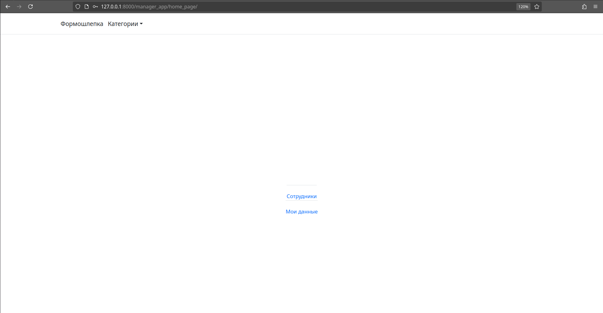
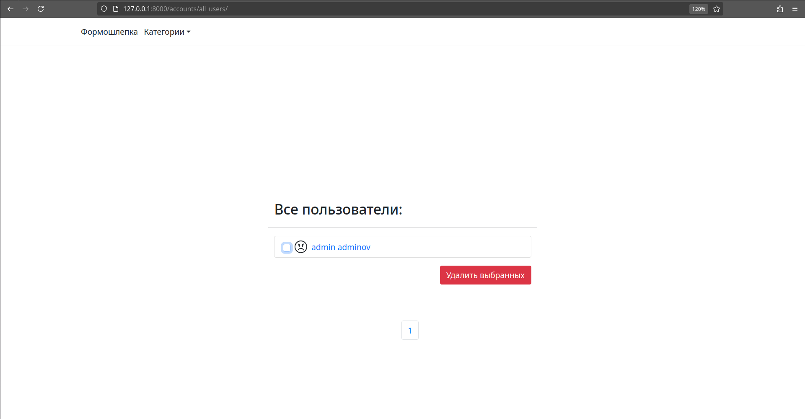
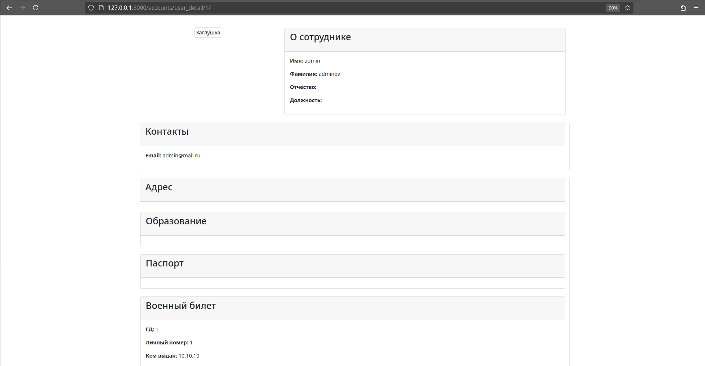

# Веб-приложение 'Формошлепка'
#### 'Формошлепка' организует информационную работу в организации.
#### Что имеется ввиду?
#### В государственных организациях очень остра следующая проблема: Вас берут на работу, вы заполняете документы: 1) паспорт 2) ИНН 3) Военный билет и прочее
#### Через неделю Вас заставляют заполнить те же самые документы еще раз чем-то аргументируя.
#### В течении этой недели, еще раз, а потом через месяц Вам звонит начальник и просит скинуть 1) паспорт 2) ИНН 3) Военный билет и прочее в Вацап, потому что даннык, которые вы заполнили не у него, а где-то там...
#### Формошлепка делает следующее - при поступлении на работу заполняете документы один раз и данные хранятся на сервере организации, где доступ к информации есть у администраторов, что исключает надобность заполнять тысячи раз одни и те же данные просто в разных формах.
#### Возможности работника: 1) хранить все нужные данные в одном месте и при необходимости заполнить, скопировать данные 2) редактировать данные 3) если начальник делает вид, что он/она не может разобраться в этих ваших  бесовских IT, скидывайте ему/ей ссылку на все данные в формошлепке.
#### Возможности админа: 1) Смотреть на данные сотрудника 2) редактировать их 3) создавать записи о сотрудниках самостоятельно, если сотрудник делает вид что что он/она не может разобраться в этих ваших  бесовских IT
#### Формошлепка решает целый ворох проблем как организационных, так и возникающих от них психологических, облегчая жизнь
#### реализована регистрация:

#### Вход:

#### посмотреть свои данные и сотрудников
#### 
#### удобное удаление списком (если от вас сотрудники бегут толпами)

#### удобное отображение данных и возможность добавить фото, потому что иногда трудно запомнить кто есть кто:

#### Жизнь должна быть легкой, а от работы надо получать удовольствие и любить ее - Решайте проблемы через Формошлепку
#### Work is in progress